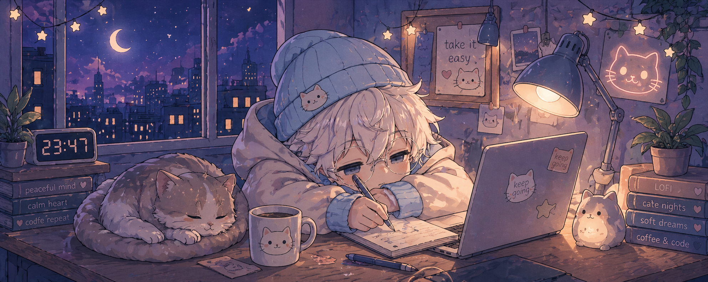

  

<h1 align="center">☁️ mooncodec ☁️</h1>

  sleepy dev • cozy code • lofi nights 🌙

  ⋆｡°✩ 🌙 ✩°｡⋆

<h3 align="center">🌸 about me</h3>

🐱 coding with a cat next to me  
🌙 late nights, soft lights  
☕ coffee & quiet focus  
☁️ building things slowly & peacefully

⋆｡°✩ 🐾 ✩°｡⋆

<h3 align="center">🌙 nightly routine</h3>

🕯️ dim lights & calm room  
🐱 cat sleeping nearby  
🎧 lofi playing softly  
💻 coding slowly

⋆｡°✩ 🌌 ✩°｡⋆

<h3 align="center">🎧 current vibe</h3>

lofi hip hop / night loops 🌙  
window open, calm night air 🍃  
warm light / quiet room 🕯️

⋆｡°✩ 🧸 ✩°｡⋆

<h3 align="center">🛠️ tools</h3>

  

⋆｡°✩ ☁️ ✩°｡⋆

<h3 align="center">☁️ little space</h3>

take it easy ♡  
code softly ☁️  
stay cozy 🌙

  

stay cozy ☁️

  

🌙🐱 thanks for stopping by 🐱🌙

